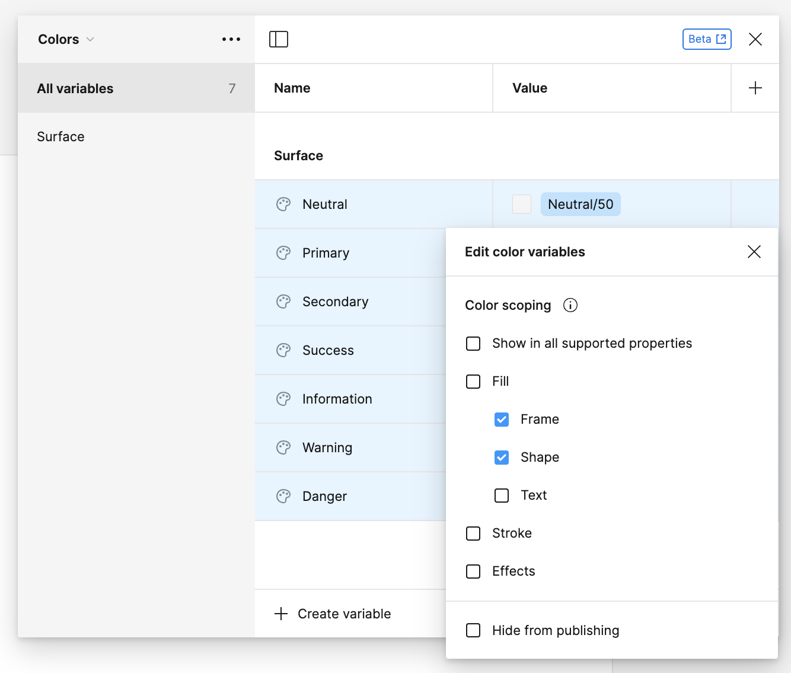

Once we have our wider color palette, it might make sense to create a curated subset of those colors that have some actual meaning. For example, we might have some callouts or alerts that we want to have a standard background color for. We can start with something like this.

You'll notice that I'm scoping these colors just to where I expect them to be used. We can do the same for text and borders as well.

> [!example] Exercise
> Can you make some variables for text and border colors? **Pro-Tip**: We'll likely want to let our text colors work for **Shape** scopes too.
>
> - **Borders** should be scoped to **Stroke**.
> - **Text** should be scoped to **Shape** and **Text**.
