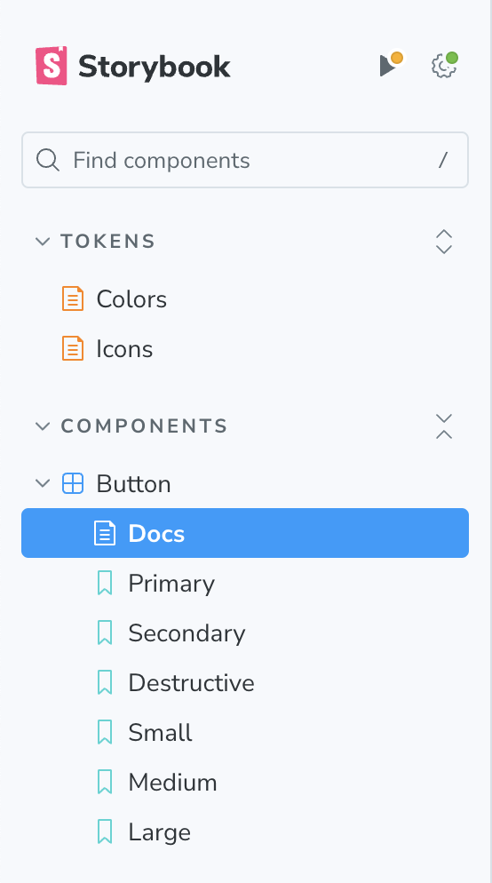

If you look at our sidebar, it's _already_ getting a little unorganized. Luckily, it's pretty easy to bring some level of organization to our components. Storybook uses the way that our components are named to form some story of hierarchy.

For example, if you name a component `Components/Button`, it will place our `Button` story under the `Components` section. Let's go ahead and try the following.

In `src/colors.mdx`:

```diff
@@ -2,7 +2,7 @@ import { Meta, ColorPalette, ColorItem } from '@storybook/blocks';
 import colors from 'tailwindcss/colors';
 import config from '../tailwind.config';

-<Meta title="Colors" />
+<Meta title="Tokens/Colors" />

 ## Brand Colors

```

In `src/components/button/button.stories.tsx`:

```diff
@@ -3,7 +3,7 @@ import type { Meta, StoryObj } from '@storybook/react';
 import { Button } from './button';

 const meta = {
-  title: 'Button',
+  title: 'Components/Button',
   component: Button,
   args: {
     children: 'Button',
```

In `src/icons.mdx`:

```diff
@@ -1,7 +1,7 @@
 import { Meta, Title, IconGallery, IconItem } from '@storybook/blocks';
 import { icons, Icon } from './components/icon';

-<Meta title="Icons" />
+<Meta title="Tokens/Icons" />

 <Title>Icons</Title>
```

## The Result

We should now live in a much more orderly world.


