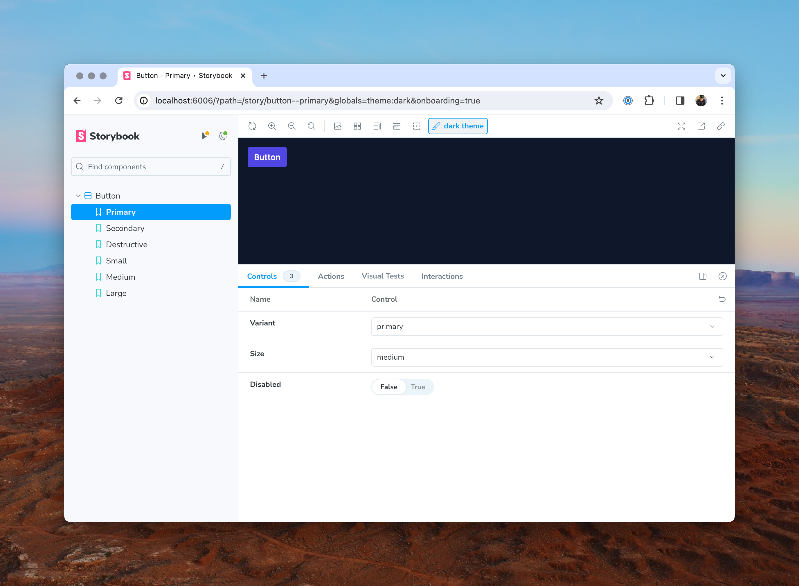

> [!important] This is not necessarily Tailwind-specific
> Almost everything in this section can be applied to any stylesheets that you happen to be using in your application, but since we're going to be using Tailwind in our design system, this has a mild-Tailwind flavor to it, but the content itself applies more broadly.
>
> There are plenty of reasons why you might consider using Tailwind and equally as many as to why it might not be the best fit. I did my best to outline my thinking [here](/writing/tailwind-and-design-systems).

Integration with [Tailwind](https://tailwindcss.com)—or, honestly—any other styles that you have set up is fairly easy with Storybook.

> [!NOTE] This has already been set up in the example project
> You can skip this step if you're following along with our example repository. I'm just including this here for your reference later.

If you need to install Tailwind, you can run the following:

```bash
npm install -D tailwindcss postcss autoprefixer
npx tailwind init --ts -p
```

## Adding Your Styles to Storybook

In `.storybook/preview.ts`, simply import any stylesheet that you want to include in your stories. These will _only_ be applied to the canvas and _not_ to the entire Storybook UI.

```diff
diff --git a/.storybook/preview.ts b/.storybook/preview.ts
index adcda96..6725718 100644
--- a/.storybook/preview.ts
+++ b/.storybook/preview.ts
@@ -1,5 +1,7 @@
 import type { Preview } from '@storybook/react';

+import '../src/index.css';
+
 const preview: Preview = {
   parameters: {
     controls: {
```

## Supporting Dark Mode

Tailwind comes with support out of the box for [Dark Mode](https://tailwindcss.com/docs/dark-mode). Tailwind defaults to using the browser's preferences (using the [`prefers-color-scheme` media query](https://developer.mozilla.org/en-US/docs/Web/CSS/@media/prefers-color-scheme)) to determine if it should render content in dark mode, but it also allows you to determine if you'd prefer to trigger dark mode using a CSS selector.

We're going to want to toggle between light and dark mode without needing to adjust our browser settings. So, let's set that up.

```diff
diff --git a/tailwind.config.ts b/tailwind.config.ts
index bc8a713..5015364 100644
--- a/tailwind.config.ts
+++ b/tailwind.config.ts
@@ -2,6 +2,7 @@ import type { Config } from 'tailwindcss';

 export default {
   content: ['./src/**/*.{js,jsx,ts,tsx,mdx,html}'],
+  darkMode: ['class', '[data-mode="dark"]'],
   theme: {
     extend: {},
   },
```

## Using the Storybook Themes Addon

Storybook's CLI has a helper to both install addons as a dependency as well as add the addon to `.storybook/main.ts`.

```bash
npx storybook@latest add @storybook/addon-themes
```

> [!failure]- If you get an error that Storybook can't find your `main.js` config
> You can just install the dependency and then [add it to the array of addons manually](add-an-addon.md).

You will be asked the following question:

```ts
? How do you toggle themes? › - Use arrow-keys. Return to submit.
❯   CSS class
    Data attribute
```

If you need to set this up manually, you can add the following to `.storybook/main.ts`.

```diff
diff --git a/.storybook/main.ts b/.storybook/main.ts
index 098b7b7..63965e0 100644
--- a/.storybook/main.ts
+++ b/.storybook/main.ts
@@ -8,6 +8,7 @@ const config: StorybookConfig = {
     '@storybook/addon-essentials',
     '@chromatic-com/storybook',
     '@storybook/addon-interactions',
+    '@storybook/addon-themes',
   ],
   framework: {
     name: '@storybook/react-vite',
```

### Using a Data Attribute

We chose to use a data attribute for dark mode, but you could also use a class. Your mileage may vary, but my mileage is informed by adding dark mode to a legacy code base. So, I am going to opt to use a data attribute.

```diff
diff --git a/.storybook/preview.ts b/.storybook/preview.ts
index 6725718..f68d778 100644
--- a/.storybook/preview.ts
+++ b/.storybook/preview.ts
@@ -1,4 +1,5 @@
 import type { Preview } from '@storybook/react';
+import { withThemeByDataAttribute } from '@storybook/addon-themes';

 import '../src/index.css';

@@ -11,6 +12,16 @@ const preview: Preview = {
       },
     },
   },
+  decorators: [
+    withThemeByDataAttribute({
+      defaultTheme: 'light',
+      themes: {
+        light: 'light',
+        dark: 'dark',
+      },
+      attributeName: 'data-mode',
+    }),
+  ],
 };

 export default preview;
```

Like I said, either answer is fine depending on your settings. I don't have a strong opinion outside from the experience of migrating an existing code base and finding out the hard way that `dark` was already being used for other purposes, so I'm going to go with the data attribute.

If all goes well, you should see something like this:


In addition to installing the dependency, this will make the following changes to your Storybook configuration.

- It will add [`@storybook/addon-themes`](https://storybook.js.org/addons/@storybook/addon-themes/) to your list of `addons` in `.storybook/main.ts`.
- It will configure a [decorator](decorators.md) in `.storybook/main.ts`.


