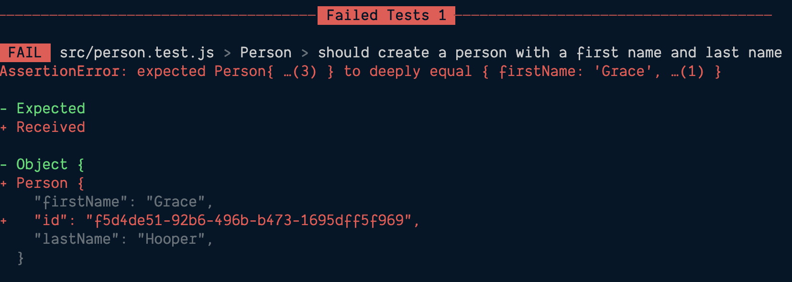

Why are they called asymmetric matchers? I don't know. But, that's what the [Jest documentation calls them](https://jestjs.io/docs/expect#asymmetric-matchers), so that's what I'm calling them. (The Vitest documentation doesn't call them anything in particular.)

**Philosophy Time™**! Here are two of my many hot takes around testing:

- Tests solely exist to give us confidence that we can make changes to our code base—large or small—without accidentally breaking things.
- Tests that are more annoying then they are helpful will lead to your and your team deleting them and/or just abandoning testing.

Winston Churchill said that "perfection is the enemy of progress." And this is somewhat true for our tests. Our tests exists to give us confidence that we can change our code. If they become too rigid (or brittle), they tend to slow us down more than they speed us up.

Secondly, when a test fails, it would be nice if the failure was laser focused to what went wrong. A minor change might break a whole suite of tests. This could be dozens or even hundreds of tests. Good luck tracking down exactly what the culprit was.

Consider this code for a moment:

```javascript
import { v4 as id } from 'uuid';

export class Person {
	constructor(firstName, lastName) {
		if (!firstName || !lastName) {
			throw new Error('First name and last name are required');
		}

		this.id = 'person-' + id();
		this.firstName = firstName;
		this.lastName = lastName;
	}

	get fullName() {
		return `${this.firstName} ${this.lastName}`;
	}
}
```

The [`uuid`](https://npm.im/uuid) library generates a random `id` every time. Sure, there are way to get around this—name mocking and stuff, which we'll talk about later. But generally speaking, we don't really care about the `id`.

Let's say we just cared if they're cool and they they have a first and last name that are strings. (I know, we have TypeScript, but I'm trying to make a point here.)

This well-meaning test is going to fail:

```javascript
it('should create a person with a first name and last name', () => {
	const person = new Person('Grace', 'Hopper');
	expect(person).toEqual({ firstName: 'Grace', lastName: 'Hopper' });
});
```



We don't really care what the `id` is but maybe we want to make sure that there *is* an `id` and that it's a string.

```javascript
it('should create a person with a first name and last name', () => {
	const person = new Person('Grace', 'Hopper');
	expect(person).toEqual({
		id: expect.any(String),
		firstName: 'Grace',
		lastName: 'Hopper',
	});
});
```

We could even make sure that the string matches a certain pattern.

```javascript
it('should create a person with a first name and last name', () => {
	const person = new Person('Grace', 'Hopper');
	expect(person).toEqual({
		id: expect.stringMatching(/^person-/),
		firstName: 'Grace',
		lastName: 'Hopper',
	});
});
```

## A More Practical Example

This is all well and good with small, easy-to-grok examples, but let's quickly glance at a [asymmetric-matching-example](asymmetric-matching-example.md).
